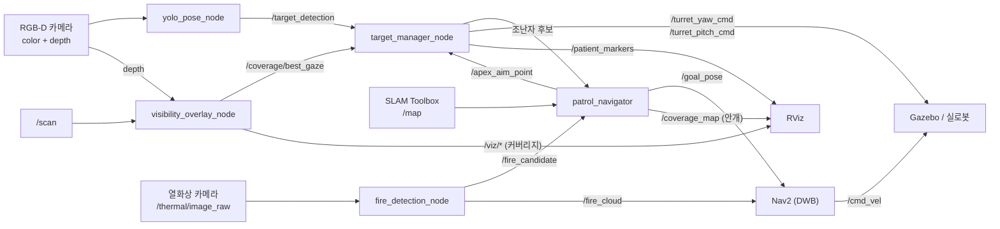

# UGV 실내 구조수색 로봇

**시각 커버리지 기반 자율 정찰 · 조난자 트리아지 · 열화상 화재 회피**

[](https://docs.ros.org/en/humble/)
[](https://gazebosim.org/docs/harmonic)
[](https://navigation.ros.org/)
[](https://www.python.org/)
[](LICENSE)

> **핵심 아이디어 — 주행과 "관측 여부"를 분리한다**
>
> LiDAR SLAM은 벽이 어디 있는지는 알려주지만, **내 카메라가 그곳을 실제로 들여다봤는지**는 모른다.
> 이 프로젝트는 둘을 분리한다. 주행은 Nav2/SLAM이 맡고, **관측 여부(시각 커버리지)** 는 별도
> 커버리지 레이어가 관리한다. 로봇은 미관측으로 남은 사각지대로 스스로 향하고, 발견한 조난자
> 앞에서는 **멈춰 서서 포탑을 조준한 뒤** 위치를 확정한다.

<p align="center">
  
  <br><sub>실물 기체 — 6륜 스키드-스티어 섀시 · 2-DOF 카메라 포탑 · SLAMTEC LiDAR · Teensy 기반 전장</sub>
</p>

---

## 목차

- [개요](#개요)
- [데모](#데모)
- [빠른 시작](#빠른-시작)
- [시스템 구성](#시스템-구성)
- [주요 기능](#주요-기능)
- [검증 결과](#검증-결과)
- [한계와 남은 과제](#한계와-남은-과제)
- [하드웨어](#하드웨어)
- [기술 스택](#기술-스택)
- [문서](#문서)

---

## 개요

**ROS 2 Humble + Gazebo Harmonic 기반 6륜 스키드-스티어 UGV 실내 구조수색** 워크스페이스입니다.
로봇이 미지의 건물에 진입해 스스로 지도를 그리며 전 구역을 관측 커버리지로 훑고, 그 과정에서
발견한 조난자를 탐지·분류·기록하며, 열화상으로 화재를 감지해 그 구역을 피해 다닙니다.

핵심은 LiDAR 점유격자와 별개로 **카메라가 실제로 관측한 영역**을 "본 곳" 격자로 관리하고,
남은 미관측 영역을 관측-우선 정책으로 지워나가는 것입니다. 여기에 구조 임무를 얹었습니다 —
조난자를 발견하면 그 자리에서 등록하지 않고 **접근·정지·조준 후 표본을 모아** 좌표를 확정하며,
구조본부가 아는 실종자 수를 다 채울 때까지 수색을 끝내지 않습니다.

| 영역 | 모듈 | 구현 내용 |
|---|---|---|
| **Coverage** | [`visibility_overlay_node.py`](src/ugv_vision/ugv_vision/visibility_overlay_node.py) | depth+LiDAR 레이캐스트로 "본 곳" 커버리지 격자(`/coverage/grid`, 4-class), NBV 시선(`/coverage/best_gaze`), 블라인드 코너·FOV 시각화 |
| **Exploration** | [`patrol_navigator.py`](src/ugv_vision/ugv_vision/patrol_navigator.py) | 프론티어 + 시각 커버리지 통합 탐사, 방 구석 우선 훑기, 지역 루프 탈출, 박힘 탈출, Nav2 생존 감시, 전장의 안개(`/coverage_map`) 발행 |
| **Perception** | [`yolo_pose_node.py`](src/ugv_vision/ugv_vision/yolo_pose_node.py) | YOLOv8n-pose 골격 검증, depth 거리 추정, 어깨 실제 높이 기반 자세 판정, 트리아지 분류 |
| **Turret · 등록** | [`target_manager_node.py`](src/ugv_vision/ugv_vision/target_manager_node.py) | 2-DOF 포탑 조준, 정지·조준 확인(INSPECT) 후 표본 중앙값 등록, 관측 거리 비례 dedup |
| **Fire** | [`fire_detection_node.py`](src/ugv_vision/ugv_vision/fire_detection_node.py) | 열화상 blob → depth 거리 → 월드 투영, `/fire_cloud`로 Nav2 코스트맵 마킹 |
| **Navigation** | [`odometry_node.py`](src/ugv_navigation/ugv_navigation/odometry_node.py) · `nav2_params.yaml` | 휠 오도메트리, Nav2(DWB) · SLAM Toolbox 설정, 화재 마킹 소스 연동 |

동일한 노드가 시뮬(Gazebo 플러그인)과 실로봇(Teensy MCU · RealSense · SLAMTEC LiDAR)
양쪽에서 동작하도록 설계했습니다.

## 데모

| 탐색 환경 (Gazebo) | 미관측 구역 시각 커버리지 (RViz) | 조난자 인식 (YOLOv8n-pose) |
|:---:|:---:|:---:|
|  |  |  |

- **탐색 환경** — 6륜 UGV가 재난 건물 내부를 자율 주행하며 조난자를 탐색
- **시각 커버리지** — LiDAR 지도와 별개로 카메라가 *실제로 관측한* 영역만 표시.
  검정(가본 적 없음) · 회색(지나갔지만 눈으로 미확인) · 투명(확인 완료)
- **조난자 인식** — 골격 검출 + 중증도(트리아지) 분류, 실측 거리 추정

## 빠른 시작

설치·의존성은 **[SETUP.md](SETUP.md)** 를 따르세요. 빌드 후:

```bash
source ~/ugv_ws/install/setup.bash
export GZ_SIM_RESOURCE_PATH=~/ugv_ws/install/ugv_description/share:$GZ_SIM_RESOURCE_PATH
```

| 목적 | 명령 |
|---|---|
| Gazebo + 로봇 스폰만 (동작 확인) | `ros2 launch ugv_bringup gazebo.launch.py` |
| SLAM + Nav2 + 비전 풀스택 | `ros2 launch ugv_bringup slam_nav_sim.launch.py` |
| 구조수색 (기본 월드) | `ros2 launch ugv_bringup patrol_sim.launch.py` |

```bash
# 큰 월드에서 실종자 7명을 다 찾을 때까지 수색
ros2 launch ugv_bringup patrol_sim.launch.py \
    world:=rescue_building_large expected_victims:=7

# 로봇 2대 병렬 수색 — 구역을 갈라 맡고, 자기 구역을 끝내면 동료를 도우러 간다
UGV_N_ROBOTS=2 UGV_BOUNDS=-27,-19,27,19 \
  ros2 launch ugv_bringup multi_robot_sim.launch.py \
    world:=rescue_building_large expected_victims:=7
```

<details>
<summary><b>기동 순서와 타이밍 제약</b></summary>

`0s` Gazebo·로봇 스폰 → `14s` SLAM → `22s` Nav2 → `48s` 비전 → `58s` 순찰·화재.

비전 노드(torch/CUDA 로딩)는 Nav2 활성화가 끝난 뒤에 띄웁니다. 겹치면 lifecycle 전환이
타임아웃나 `planner_server`가 unconfigured 로 남습니다.
</details>

실행 상세·튜닝은 **[HOW_TO_RUN.md](HOW_TO_RUN.md)**, 노드·알고리즘·토픽 전체 설계는
**[ARCHITECTURE.md](ARCHITECTURE.md)** 를 참조하세요.

## 시스템 구성



<details>
<summary><b>저장소 구조</b></summary>

```text
.
├── README.md · SETUP.md · HOW_TO_RUN.md · ARCHITECTURE.md
├── docs/
│   ├── EXPERIMENTS.md          # 검출 실패 원인 규명 · 채택하지 않은 시도들
│   ├── SCALING.md              # 로봇 대수 × 맵 크기 확장성 실측
│   └── media/
├── tools/                      # 실험 러너 · 채점기 · 단위 테스트 17종
└── src/
    ├── ugv_vision              # 핵심 — 커버리지·탐사·탐지·포탑·화재
    │   ├── patrol_navigator.py            # 프론티어+커버리지 탐사, 안개 발행
    │   ├── target_manager_node.py         # 포탑 시선 + 정지·조준 확인 등록
    │   ├── yolo_pose_node.py              # YOLOv8n-pose 탐지 + 자세 판정
    │   ├── fire_detection_node.py         # 열화상 화재 감지·회피
    │   ├── visibility_overlay_node.py     # 커버리지 격자 + NBV 시선
    │   └── (vision_coverage_navigator · tactical_commander · visual_coverage_map)
    │                                      # 이전 버전, 현재 미기동
    ├── ugv_navigation          # Nav2 / SLAM 설정, 오도메트리
    ├── ugv_bringup             # 시뮬·실로봇 통합 launch, 월드 SDF
    ├── ugv_description         # URDF/xacro 모델, RViz 설정
    ├── ugv_msgs                # TargetDetection · ChassisCommand · TurretCommand
    └── ugv_teleop              # 조이스틱/키보드 텔레옵
```

서드파티(`micro_ros_setup` · `sllidar_ros2` · `uros`)는 포함하지 않습니다. 실로봇 전용이라
시뮬 빌드에서 제외되며, 필요하면 `src/ros2.repos` 로 받으세요.
</details>

## 주요 기능

### 1. 커버리지 단일 소유 + 전장의 안개

SLAM 점유격자와 **별개의 "본 곳" 격자**를 관리합니다 — 라이다가 지나간 것과 카메라가
들여다본 것은 다릅니다. `patrol_navigator` 가 `/coverage_map` 으로 발행해 RViz 에서 안개처럼
표시하며, 방을 통과만 하고 구석을 안 본 경우가 SLAM 지도상으로는 멀쩡해 보이는 문제를
이 레이어가 드러냅니다.

### 2. 프론티어 + 커버리지 통합 탐사

- **주변 미관측 우선** — 들어간 방의 사각지대부터 훑고 나갑니다(연속 3회까지, 그 뒤 밖으로)
- 목표 제한시간을 **거리에 비례**해 배정(`15초 + 거리/0.25`) — 큰 맵에서 먼 목표가 무조건
  실패하던 문제를 해결
- 후보가 마르면 **8m 이상 떨어진 가장 큰 미관측 구역으로 강제 이탈**해 지역 루프 탈출
- 박힘 감지 시 후진 탈출. Nav2 생존은 `/goal_pose` 구독자 수로 직접 확인

### 3. 정지·조준 확인 후 등록 (INSPECT)

이동 중 마킹하면 좌표가 튑니다. 후보를 보면 **대상 앞 3.0m까지 접근 → 정지 → 포탑 조준 →
표본 5개 중앙값**으로 등록합니다. 직선 접근이 막히면 대상 주위를 둘러 설 자리를 찾고,
관측 거리에 비례한 dedup 반경으로 같은 사람의 이중 등록을 차단하되 더 가까이서 다시 보면
좌표를 정밀화합니다.

### 4. 자세 기반 트리아지

트리아지 모델이 앉은 자세를 학습하지 않아 휠체어 환자가 정상(L3)으로 분류되던 문제를
기하 판정으로 보정했습니다. 다리 비율은 가림에 취약합니다 — 휠체어는 바퀴가 다리를 가려
YOLO 가 **기립 골격을 지어냅니다**. 그래서 가림에 강한 **어깨의 실제 높이**를 씁니다
(깊이 + 화소 위치 + 카메라 높이, 핀홀 모델).

등급은 `L1:Critical`(누움) · `L2:NeedHelp`(부축 필요) · `L3:Normal`(자력 대피) 입니다.
L2 는 '의학적으로 급함' 이 아니라 **'스스로 대피할 수 없음'** 을 뜻합니다 — 이 로봇은
활력징후를 재지 못합니다.

### 5. 열화상 화재 감지 · 회피

열화상 blob 의 **모든 픽셀**로 거리를 추정합니다(가장자리만 쓰면 벽으로 튑니다).
조난자와 동일하게 정지·조준 확인 후 등록하고, 실패한 열원은 일정 시간 재시도를 억제합니다.
`/fire_cloud` 를 Nav2 global costmap 마킹 소스로 물려 **경로 자체가 화재를 피합니다.**

### 6. 실종자 수 기반 수색 종료

`expected_victims` 로 구조본부가 아는 실종자 수를 주면, 다 찾기 전에는 수색을 끝내지 않고
채우는 즉시 보고합니다.

### 7. 다중 로봇 병렬 수색

`UGV_N_ROBOTS` 로 1~3대를 구성합니다. 구역을 갈라 맡고, 자기 구역을 다 훑으면 동료 구역으로
넘어가 돕습니다. 지도·표적·화재를 공유하고 목표를 선점해 같은 곳으로 몰리지 않게 합니다.

## 검증 결과

> **측정 방법** — 모든 수치는 **유효 런** 기준입니다. 로봇 중 하나라도 YOLO 가 아무것도 못 본
> 런(키포인트 0)과 중간에 끊긴 런은 표본에서 제외합니다. 조건을 머신에 붙이지 않고 **한 머신
> 안에서 번갈아** 돌리며, 결론은 **두 대 이상의 머신에서 재현될 때만** 채택합니다.
> 지표는 '전원 발견까지 걸린 시간' 이 아니라 **'고정 시점에 센 인원수'** 입니다 — 앞의 것은
> 가장 늦게 찾은 한 명이 값을 정하는 최댓값 통계라 편차가 크고, 시간 안에 못 끝낸 런이
> 표본에서 빠져 완주한 런만 비교하게 됩니다.

### 탐지 · 측위 정확도

자동 채점(`tools/run_eval.sh`) 결과입니다.

| 항목 | 결과 |
|---|---|
| 트리아지 정확도 | **7/7** (L1 2명 · L2 1명 · L3 4명) |
| 평균 위치 오차 | **0.54 m** (표본 산포 0.01 m 이하) |
| 화재 발견 | **4/4** (오차 0.41~0.60 m) |
| 오탐 · 중복 등록 | 0건 |
| Nav2 사망 · goal 오인 | 0회 |

작은 월드(`rescue_building`)도 조난자 3/3 · 트리아지 3/3 · 화재 2/2 로 합격합니다.

> 이 표는 **조난자 배치를 바꾸기 전** 큰 월드에서 잰 값입니다. 7명 중 4명이 멀쩡히 서 있어
> 재난 현장에 맞지 않았고 어려운 자세가 거의 시험되지 않아서, 지금은 **누움 3 / 서있음
> 3(잔해에 가린 1 포함) / 휠체어 1**(트리아지 L1 3 · L2 1 · L3 3)로 바꿨습니다. 위치 오차와
> 화재 측위는 배치와 무관한 인식 스택의 지표라 그대로 유효하지만, 트리아지 내역은 옛 구성
> 기준입니다. 아래 완주율은 모두 **바뀐 배치** 에서 다시 잰 값입니다.

### 수색 완주 성능 — 큰 월드 (56×40 m, 조난자 7명)

| | 1대 | 2대 |
|---|---|---|
| 7/7 완주까지 | 중앙값 **26분** (22~38분) | 중앙값 **18분** (12~30분) |
| 30분 안에 완주 | **4/7 (57%)** | **82% · 90%** |
| 조난자별 발견률 | 7명 전원 7/7 | `lying_s2` 84~94% · 나머지 96~100% |
| 유령 검출 | 1건 / 7런 | 2건 · 1건 / 각 50런 |

2대는 **유효 50런짜리 검증을 두 번**(머신당 25런씩) 돌려 82% 와 90% 가 나왔습니다.
신뢰구간이 겹쳐 서로 모순되지 않지만, 두 검증 사이에 계측 로깅이 추가돼 코드가 완전히
같지는 않으므로 **합치지 않고 따로 적습니다.** 한 번만 쟀으면 어느 쪽이든 과신이었을 폭입니다.

개선 경과입니다. 자세한 원인 규명은 **[docs/EXPERIMENTS.md](docs/EXPERIMENTS.md)** 에 있습니다.

| 설정 | 7/7 완주율 |
|---|---|
| 포탑 수평 · `seen_min_dirs` 끔 | 22% |
| 포탑 0.20 rad | 67% |
| **포탑 0.10 rad + `seen_min_dirs`** | **82% · 90%** |

### 완주율은 알고리즘이 아니라 제한 시간이 정합니다

못 찾은 런은 대부분 같은 사람(남서 방 바닥에 누운 조난자)을 놓칩니다. 그 방은 남쪽 다섯 방 중
유일하게 내부 칸막이가 있어, 문이 15m 깊이 주머니의 구석에 붙어 있습니다. **그 주머니 안쪽까지
내려간 런은 34런 중 33런이 찾았고, 못 내려간 런은 6런 중 0런이 찾았습니다.**

처음에는 탐사 알고리즘의 결함으로 보고 여덟 가지를 시험했지만 이득이 확인된 것은 하나도
없었습니다. 제한을 45분으로 늘리자 **기본 설정이 그 조난자를 11런 전부 찾았습니다.**
로봇은 그 구석에 갈 줄 압니다 — 30분 안에 못 갈 뿐입니다.

| 제한 시간 | 7/7 완주율 |
|---|---|
| 20분 | 56% |
| 25분 | 77% |
| **30분** | **86%** |
| 35분 | 91% |
| 40분 이상 | 91% |

**86% 는 알고리즘의 한계가 아니라 30분이라는 예산의 값입니다.** 더 올리려면 탐사 정책이 아니라
시간이나 로봇 대수를 늘리는 쪽입니다.

### 로봇 대수 확장 — XL 월드 (84×40 m, 조난자 13명, 제한 45분)

시점별 발견 인원(중앙값 / 평균)입니다. 상세는 **[docs/SCALING.md](docs/SCALING.md)** 를 참조하세요.

| 구성 | 유효 런 | 10분 | 20분 | 30분 | 45분 |
|---|---:|---:|---:|---:|---:|
| 1대 | 6 | 3 / 2.7 | 6 / 6.0 | 10 / 8.7 | 11 / 10.8 |
| **2대** | 26 | **6 / 5.9** | **9 / 9.2** | **11 / 11.3** | **12 / 12.1** |
| 3대 | 26 | 6 / 5.9 | 9 / 9.2 | 11 / 10.5 | 12 / 11.3 |

- **1대 → 2대는 확실한 이득입니다.** 10분 시점 발견 인원이 두 배(3 → 6명)로, 두 머신·두 맵에서
  재현됐습니다.
- **2대 → 3대는 오히려 손해입니다.** 초반(10·20분)은 완전히 같고 후반에 3대가 뒤집니다.
  45분 시점 분포를 보면 2대는 최저 11명·전원 발견 5런인데, 3대는 최저 8명·10명 미만 3런이고
  전원 발견은 0런입니다.

**원인은 Nav2 경로 탐색 실패 루프입니다.** 로봇당 `planner_server` Abort 가 2.2배로 늘고
(23.6 → 51.0회), Abort 가 많은 런이 그대로 성적이 나쁜 런입니다(417회 → 8명). 2대에서는
Abort 가 167회여도 12명을 찾아 상관이 없습니다.

| | 2대 | 3대 |
|---|---:|---:|
| 로봇당 실패 루프 발생률 | 1.9% | **7.7%** |
| 그런 런의 비율 | 4% (1/26) | **23%** (6/26) |

로봇 수만 늘어난 것이라면 3대의 런 비율은 5.6% 여야 하는데 실측은 23% 입니다.
**로봇 하나하나가 더 위험해집니다** — 주 복도가 하나뿐이라 세 대가 서로를 코스트맵
장애물로 보면 경로가 막히는 상황이 잦아지고, 한 번 빠진 로봇은 복구행동을 돌며 45분을
태워 그 구역이 통째로 비어 버립니다.

호스트 CPU 경합이나 벽시계 제한 시간 때문은 아닙니다(둘 다 기각, [docs/SCALING.md](docs/SCALING.md)).

> **이 결과는 메인 한 대에서만 나온 잠정 결론입니다.** 두 번째 머신에서 2대 16런 ·
> 3대 15런을 쟀는데 **거기서는 둘이 동률이었습니다**(45분 평균 11.9 대 11.9).
> 기전은 메인에서 분명히 보였지만, 그것이 어느 환경에서나 3대를 나쁘게 만드는지는
> 확인되지 않았습니다. 권장 구성은 **2대**입니다 — 3대가 이득이라는 근거는
> 어느 머신에서도 없습니다.

작은 월드(28×20 m)에서는 대수를 늘려도 이득이 없었습니다. 다중 로봇이 값어치를 하려면
방이 충분히 많아야 합니다.

## 한계와 남은 과제

- **탐사 시간의 약 30%(70분 중 17~23분)를 유령 후보에 씁니다.** 멀리서 사람처럼 보인 대상까지
  접근·정지·조준한 뒤 버리는 비용입니다. 접근 전에 걸러내려 세 가지를 시도했고 **셋 다
  실패했습니다** — 프레임 단위 필터링으로는 접근 낭비가 줄지 않습니다(후보가 다른 프레임에서
  다시 뜨므로). 남은 방향은 접근 비용 자체를 줄이는 쪽입니다. 시도 기록은
  [docs/EXPERIMENTS.md](docs/EXPERIMENTS.md) 에 있습니다.
- **오탐이 인원수를 채우면 '전원 발견' 이 잘못 보고됩니다.** 실제로 1회 발생했습니다(잔해와 벽
  사이 빈 공간을 사람으로 인식). 자세 판정으로는 거를 수 없어 다른 시점에서 재확인하는 방식이
  필요합니다. 채점기는 이 사고를 자동으로 잡습니다.
- **3대 구성에서 로봇이 Nav2 경로 탐색 실패 루프에 빠집니다**(로봇당 7.7%, 런의 23%).
  원인은 규명했지만 아직 고치지 않았습니다. 방향은 실패가 일정 횟수를 넘으면 그 목표를
  버리고 다른 구역으로 보내거나, 로봇끼리 코스트맵에서 서로를 지우는 쪽입니다.
- 커버리지 완주 후의 회차 완료 보고는 아직 실측하지 못했습니다.
- 직선 접근이 막혔을 때의 우회 접근은 단위 테스트로만 검증됐습니다(실측 발동 0회).
- 실로봇 통합은 진행 중입니다. 열화상 카메라는 시뮬 전용이며, 실기에는 아직 없습니다.

## 하드웨어

<p align="center">
  
</p>

| 구성 | 사양 |
|---|---|
| 구동 | 6륜 스키드-스티어 · 바퀴 r=42 mm · 트랙 162.5 mm · 최대 0.65 m/s |
| 포탑 | 2-DOF(yaw+pitch) · 110 rpm(≈1.15 rad/s) · 카메라 마운트 |
| 카메라 | RealSense depth+RGB · 수평 FOV 62° · 640×480 |
| LiDAR | SLAMTEC(RPLIDAR) 360° |
| 제어 | Teensy MCU(micro-ROS) ↔ Jetson Orin · x86_64 데스크탑 이식 |

Perception(D435i·LiDAR) → High-level(Jetson Orin Nano: YOLO 트리아지·SLAM·Nav2)
↔ Real-time(Teensy 4.1: EKF 융합·PID·6WD 스키드 기구학)
→ Actuation(BTS7960 ×7 모터 드라이버·포탑 서보)

<p align="center">
  
</p>

## 기술 스택

| 분류 | 사용 기술 |
|---|---|
| 미들웨어 | ROS 2 Humble · Python 3.10 · Ubuntu 22.04 |
| 시뮬레이션 | Gazebo Harmonic (gz-sim8) |
| 자율주행 | Nav2 (DWB) · SLAM Toolbox · robot_localization (EKF) |
| 인식 | YOLOv8n-pose (Ultralytics) · scikit-learn (RandomForest 트리아지) · OpenCV |
| 실로봇 | micro-ROS (Teensy 4.1) · SLAMTEC LiDAR · RealSense |

## 문서

| 문서 | 내용 |
|---|---|
| [SETUP.md](SETUP.md) | 설치 · 의존성 · 빌드 |
| [HOW_TO_RUN.md](HOW_TO_RUN.md) | 실행 · 튜닝 · 트러블슈팅 |
| [ARCHITECTURE.md](ARCHITECTURE.md) | 노드 · 알고리즘 · 토픽 전체 설계 |
| [docs/EXPERIMENTS.md](docs/EXPERIMENTS.md) | 검출 실패 원인 규명 · 채택하지 않은 시도들 |
| [docs/SCALING.md](docs/SCALING.md) | 로봇 대수 × 맵 크기 확장성 실측 |

## 라이선스

[MIT](LICENSE)
