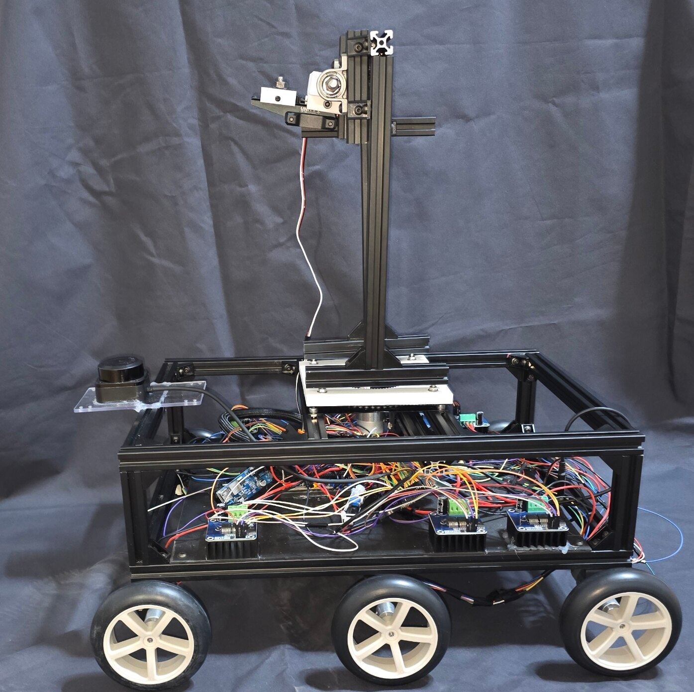
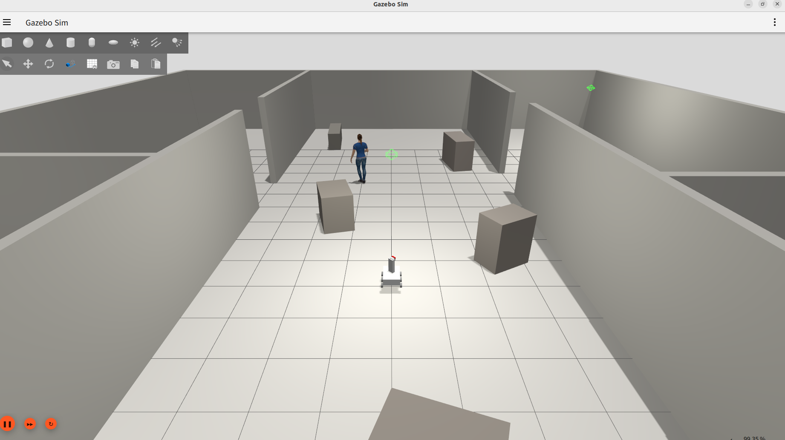
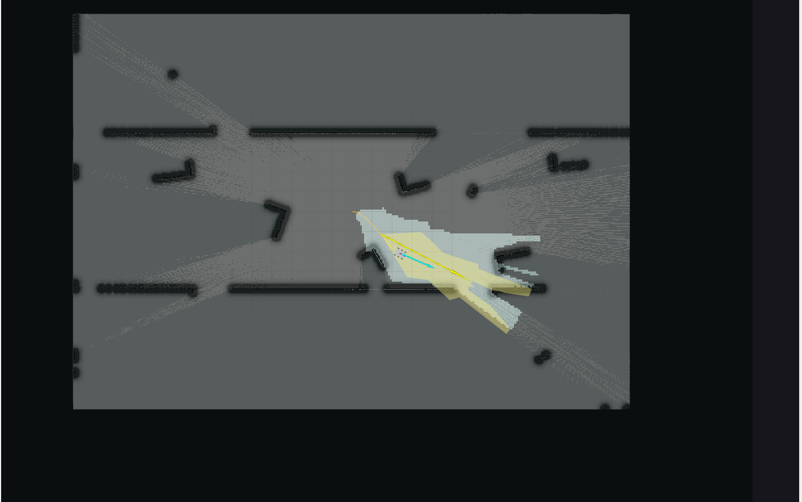
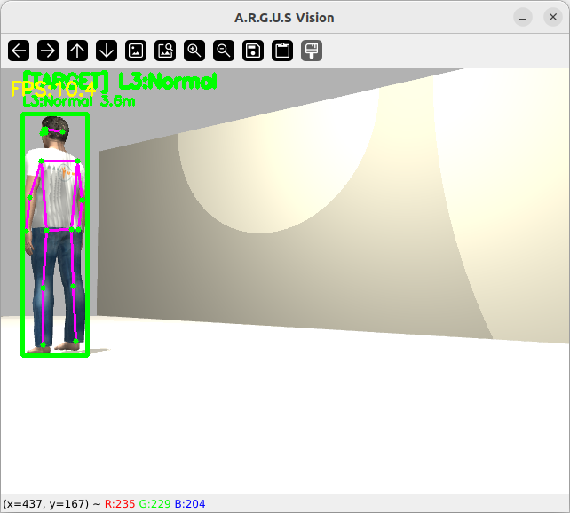
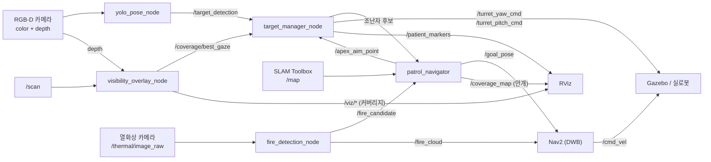
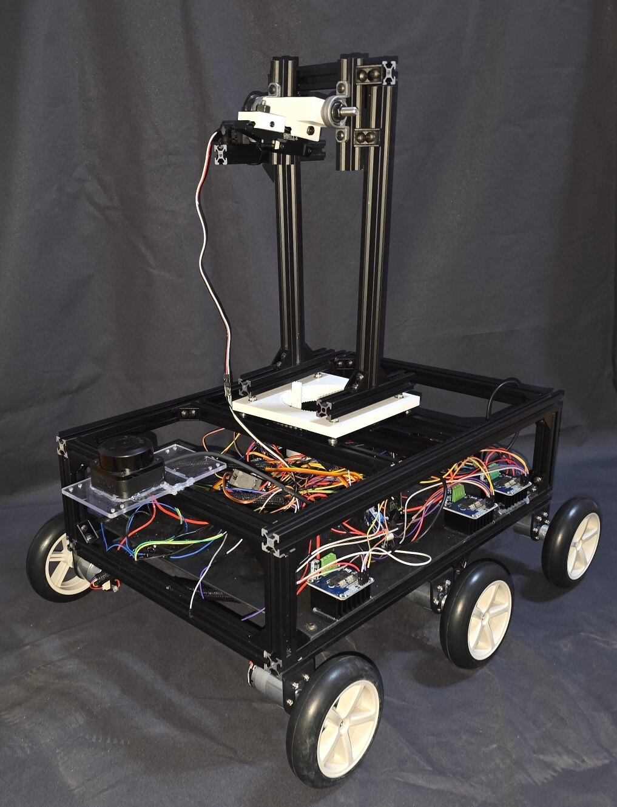
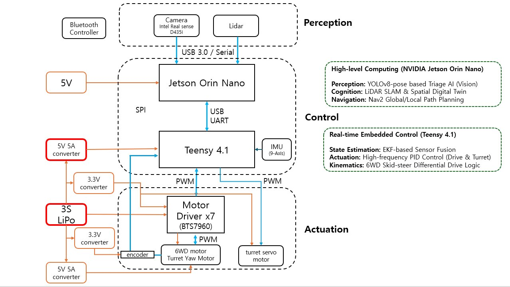

# UGV 실내 구조수색 로봇 — 시각 커버리지 기반 정찰 + 조난자 트리아지

> ## 핵심: 주행과 "관측 여부"를 분리
> LiDAR SLAM은 벽이 어디 있는지는 알려주지만, **내 카메라가 그곳을 실제로 들여다봤는지**는 모른다.
> 이 프로젝트는 둘을 분리한다 — 주행은 Nav2/SLAM이, **관측 여부(시각 커버리지)** 는 별도 커버리지 레이어가 관리한다.
> 로봇은 미관측으로 남은 사각지대로 스스로 향하고, 발견한 조난자 앞에서는 **멈춰 서서 포탑을 조준한 뒤** 위치를 확정한다.

<p align="center">
  
  <br><sub>실물 기체 — 6륜 스키드-스티어 섀시 · 2-DOF 카메라 포탑 · SLAMTEC LiDAR · Teensy 기반 전장</sub>
</p>

## 개요

이 저장소는 **ROS 2 Humble + Gazebo Harmonic 기반 6륜 스키드-스티어 UGV 실내 구조수색** 워크스페이스입니다.
로봇이 미지의 건물에 진입해 스스로 지도를 그리며 전 구역을 관측 커버리지로 훑고, 그 과정에서 발견한 조난자를
탐지·분류·기록하며, 열화상으로 화재를 감지해 그 구역을 피해 다닙니다.

핵심은 LiDAR 점유격자와 별개로 **카메라가 실제로 관측한 영역**을 "본 곳" 격자로 관리(시각 커버리지)하고,
남은 미관측 영역을 관측-우선 정책으로 지워나가는 것입니다. 여기에 **구조 임무**를 얹었습니다 —
조난자를 발견하면 그 자리에서 등록하지 않고 **접근·정지·조준 후 표본을 모아** 좌표를 확정하며,
구조본부가 아는 실종자 수를 다 채울 때까지 수색을 끝내지 않습니다.

- `Coverage`: 카메라 FOV·depth로 "본 곳" 격자 갱신, 미관측 영역을 전장의 안개로 실시간 시각화
- `Navigation`: 프론티어 + 시각 커버리지 통합 순찰(`patrol_navigator`) → Nav2(DWB) 목표 발행
- `Perception`: YOLOv8n-pose 조난자 탐지 + 자세 기반 트리아지, 월드좌표 기록
- `Fire`: 열화상 blob → depth 거리 → 월드 투영, Nav2 코스트맵에 마킹해 화재 구역 회피
- `Turret`: 2-DOF 포탑 독립 조준, 정지·조준 확인(INSPECT) 후 등록

> 시뮬(Gazebo 플러그인)과 실로봇(Teensy MCU · RealSense · SLAMTEC LiDAR)에서 동일 노드가 동작하도록 설계했습니다.

## 데모

| 탐색 환경 (Gazebo) | 미관측 구역 시각 커버리지 (RViz) | 조난자 인식 (YOLOv8n-pose) |
|:---:|:---:|:---:|
|  |  |  |

- **탐색 환경** — 6륜 UGV가 재난 건물 내부를 자율 주행하며 조난자를 탐색
- **시각 커버리지** — LiDAR 지도와 별개로 카메라가 *실제로 관측한* 영역만 표시. 미관측 구역(검정·회색 안개)을 훑으며 정찰
- **조난자 인식** — YOLOv8n-pose 골격 검출 + 중증도(트리아지) 분류, 실측 거리 추정

## 구현 범위

| 영역 | 모듈 | 구현한 내용 |
|---|---|---|
| Coverage | [`visibility_overlay_node.py`](src/ugv_vision/ugv_vision/visibility_overlay_node.py) | depth+LiDAR 레이캐스트로 "본 곳" 커버리지 격자(`/coverage/grid`, 4-class), NBV 시선(`/coverage/best_gaze`), 블라인드 코너·FOV·이동궤적 시각화 |
| Exploration | [`patrol_navigator.py`](src/ugv_vision/ugv_vision/patrol_navigator.py) | 프론티어 + 시각 커버리지 통합 탐사, 방 구석 우선 훑기, 지역 루프 탈출, 장애물 박힘 탈출, Nav2 생존 감시, 전장의 안개(`/coverage_map`) 발행 |
| Perception | [`yolo_pose_node.py`](src/ugv_vision/ugv_vision/yolo_pose_node.py) | YOLOv8n-pose 골격 검증, depth/대각선 거리 추정, **어깨 실제 높이 기반 자세 판정**, 트리아지 분류, `/target_detection` 발행 |
| Turret · 등록 | [`target_manager_node.py`](src/ugv_vision/ugv_vision/target_manager_node.py) | 2-DOF 포탑 조준, **정지·조준 확인(INSPECT) 후 표본 중앙값 등록**, 관측 거리 비례 dedup·좌표 정밀화 |
| Fire | [`fire_detection_node.py`](src/ugv_vision/ugv_vision/fire_detection_node.py) | 열화상 blob → depth 거리 → 월드 투영, 정지·조준 확인 후 등록, `/fire_cloud`로 Nav2 회피 |
| Navigation | [`odometry_node.py`](src/ugv_navigation/ugv_navigation/odometry_node.py) · `nav2_params.yaml` | 휠 오도메트리, Nav2(DWB)·SLAM Toolbox 설정, 화재 마킹 소스 연동 |

## 목표

- LiDAR로 열린 공간이라도 **카메라로 못 본 구역**을 남김없이 관측 커버리지로 소거
- 조난자를 **움직이면서 마킹하지 않기** — 접근·정지·조준 후 표본을 모아 좌표를 확정
- 자세만으로 **자력 대피 가능 여부**를 판별 (누움 / 부축 필요 / 자력 대피)
- 구조본부가 아는 **실종자 수를 다 채울 때까지** 수색을 끝내지 않고, 채우는 즉시 보고
- 열화상 화재를 감지해 **경로 자체가 화재를 피하도록** Nav2에 반영
- 동일 노드가 시뮬·실로봇 양쪽에서 도는 Sim↔실기 패리티

## 시스템 파이프라인



## 주요 기능

### 1. 커버리지 단일 소유 + 전장의 안개
- SLAM 점유격자와 **별개의 "본 곳" 격자**를 관리 — 라이다가 지나간 것과 카메라가 들여다본 것은 다르다
- `patrol_navigator`가 `/coverage_map`으로 발행해 RViz에서 **안개처럼** 표시
  - 검정(100) = 가본 적 없음 · 회색(55) = 지나갔지만 눈으로 미확인 · 투명 = 확인 완료
- 방을 통과만 하고 구석을 안 본 경우가 SLAM 지도상으로는 멀쩡해 보이는 문제를 이 레이어가 드러냄

### 2. 프론티어 + 커버리지 통합 탐사 (patrol_navigator)
- **주변 미관측 우선** — 들어간 방의 사각지대부터 훑고 나감(연속 3회까지, 그 뒤 밖으로)
- 목표 제한시간을 **거리에 비례**해 배정(`15초 + 거리/0.25`) — 큰 맵에서 먼 목표가 무조건 실패하던 문제 해결
- 후보가 마르면 **8m 이상 떨어진 가장 큰 미관측 구역으로 강제 이탈**해 지역 루프 탈출
- 박힘 감지 시 후진 탈출. Nav2 생존은 `/goal_pose` 구독자 수로 직접 확인

### 3. 정지·조준 확인 후 등록 (INSPECT)
- 이동 중 마킹하면 좌표가 튄다 — 후보를 보면 **대상 앞 3.0m까지 접근 → 정지 → 포탑 조준 → 표본 5개 중앙값**으로 등록
- 직선 접근이 막히면 대상 주위를 둘러 설 자리를 찾음
- 관측 거리에 비례한 dedup 반경으로 같은 사람의 이중 등록 차단, 더 가까이서 다시 보면 **좌표를 정밀화**

### 4. 자세 기반 트리아지
- 트리아지 모델이 앉은 자세를 학습하지 않아 휠체어 환자가 정상(L3)으로 분류되던 문제를 기하 판정으로 보정
- 다리 비율은 가림에 취약하다 — 휠체어는 바퀴가 다리를 가려 YOLO가 **기립 골격을 지어낸다**
- 그래서 가림에 강한 **어깨의 실제 높이**를 쓴다(깊이 + 화소 위치 + 카메라 높이, 핀홀 모델)
- 등급: `L1:Critical`(누움) · `L2:NeedHelp`(부축 필요) · `L3:Normal`(자력 대피)
  - L2는 '의학적으로 급함'이 아니라 **'스스로 대피할 수 없음'** 이다. 이 로봇은 활력징후를 재지 못한다

### 5. 열화상 화재 감지 · 회피
- 열화상 blob의 **모든 픽셀**로 거리를 추정(가장자리만 쓰면 벽으로 튄다)
- 조난자와 동일하게 정지·조준 확인 후 등록, 실패한 열원은 일정 시간 재시도 억제
- `/fire_cloud`를 Nav2 global costmap 마킹 소스로 물려 **경로 자체가 화재를 피함**

### 6. 실종자 수 기반 수색 종료
- `expected_victims`로 구조본부가 아는 실종자 수를 주면, 다 찾기 전에는 수색을 끝내지 않음
- 다 훑었는데 인원이 모자라면 시야 기록을 지우고 **재수색**
- 인원을 채우는 즉시 **전원 발견 보고**(등급별 인원·좌표·화재), 이후는 명단에 없는 조난자 대비 **보충 수색**

## 노드별 요약

### `patrol_navigator.py` — 탐사 두뇌 (몸통 이동)
프론티어와 시각 커버리지를 함께 보고 Nav2 목표를 발행하며 전 구역을 순찰합니다. 조난자·화재 확인 요청을 받으면 접근·정지를 조율합니다.
- 주요 입력: `/map`, `/odom`, `/fire_alert`, `/fire_candidate`, `/investigate_request`, `/goal_pose`(에코)
- 주요 출력: `/goal_pose`, `/coverage_map`, `/apex_aim_point`, `/patrol_markers`, `/sweep_complete`

### `target_manager_node.py` — 포탑 시선 관리 + 환자 등록
포탑을 우선순위로 조준하고, 정지·조준이 붙은 상태에서만 표본을 모아 조난자를 등록합니다.
- 주요 입력: `/target_detection`, `/coverage/best_gaze`, `/viz/blind_corners`, `/odom`, `/joint_states`, `/joy`
- 주요 출력: `/turret_yaw_cmd`, `/turret_pitch_cmd`, `/patient_markers`, `/turret_heading`, `/investigate_request`

### `yolo_pose_node.py` — 조난자 탐지 · 자세 판정
RGB+depth 동기 프레임에서 사람 골격을 검증하고, 거리·자세·트리아지를 붙여 발행합니다.
- 주요 입력: `/camera/.../color/image_raw`, `/camera/.../aligned_depth_to_color/image_raw`, `/joint_states`
- 주요 출력: `/target_detection`, `/detection/image_annotated`

### `fire_detection_node.py` — 열화상 화재 감지
열화상 blob을 월드좌표로 투영하고, 정지·조준 확인 후 화재를 등록해 Nav2가 피하도록 마킹합니다.
- 주요 입력: `/thermal/image_raw`, `/camera/.../aligned_depth_to_color/image_raw`, `/odom`, `/joint_states`
- 주요 출력: `/fire_heatmap`, `/fire_cloud`, `/fire_alert`, `/fire_candidate`, `/fire/image_annotated`

### `visibility_overlay_node.py` — 커버리지 격자 + NBV 시선
depth+LiDAR+SLAM을 융합해 커버리지 격자를 발행하고, 미관측을 가장 많이 걷을 포탑 시선을 계산합니다.
- 주요 입력: `/camera/.../aligned_depth_to_color/image_raw`, `/scan`, `/map`, `/odom`, `/joint_states`
- 주요 출력: `/coverage/grid`, `/coverage/best_gaze`, `/viz/seen_persistent`, `/viz/walls`, `/viz/active_fov`, `/viz/blind_corners`

## 로봇 2대 병렬 수색

두 번째 로봇을 붙였습니다. 구역을 갈라 맡고, 자기 구역을 다 훑으면 동료
구역으로 넘어가 돕습니다. 지도·표적·화재를 공유하고 목표를 선점해 같은
곳으로 몰리지 않게 합니다.

```bash
UGV_N_ROBOTS=2 UGV_BOUNDS=-27,-19,27,19 \
  ros2 launch ugv_bringup multi_robot_sim.launch.py \
    world:=rescue_building_large expected_victims:=7
```

**1대보다 약 1.4배 빠릅니다.** 같은 머신·같은 시간대에 이어 돌려 짝지어
비교했습니다(1200초 시점 발견 인원).

| 머신 | 2대 | 1대 |
|---|---|---|
| OMEN r1 | 7명 | 3명 |
| OMEN r2 | 6명 | 5명 |
| OMEN r3 | 6명 | 4명 |
| 메인 | 7명 | 6명 |

4쌍 전부 2대가 이겼고 평균 +2.0명(4.5 → 6.5)입니다. 두 머신에서 재현됐습니다.

작은 월드에서는 이득이 없었습니다. 2대가 값어치를 하려면 방이 충분히 많아야
합니다.

> 지표를 '전원 발견까지 걸린 시간' 에서 '고정 시간에 센 인원수' 로 바꿨습니다.
> 앞의 것은 가장 늦게 찾은 한 명이 값을 정하는 최댓값 통계라 편차가 크고
> (같은 조건에서 700초와 2672초), 시간 안에 못 끝낸 런은 표본에서 빠져
> 완주한 런만 비교하게 됩니다. (`tools/victims_at.py`)

## 누운 조난자를 못 찾던 원인

7/7 완주가 절반에 그쳤습니다. 조난자별로 갈라 보니 **누운 자세**만
문제였습니다 — 잔해에 일부러 가려 놓은 조난자는 100% 찾는데 바닥에 누운
사람은 못 찾았습니다.

인식기 파라미터를 다섯 개 돌렸지만 하나도 안 움직였습니다. 로봇을 누운
조난자 2m 앞에 세우고 **카메라 화면을 저장해 보고서야** 원인이 나왔습니다.

**몸이 화면 아래로 잘려 있었습니다.** 카메라 높이 0.5m, 수직 FOV 48.9도라
수평으로 조준하면 화면 아래끝이 바닥과 만나는 지점이 **1.10m** 입니다.
그보다 가까운 바닥은 아예 안 찍힙니다.

탐색 중 포탑을 **11.5도 아래로** 두는 것으로 고쳤습니다(`search_pitch`).

각도를 훑어 **0.10rad(5.7도)** 로 정했습니다(값당 6런).

| 각도 | 누움 | 서있음 | 7/7 |
|---|---|---|---|
| **0.10** | **18/18** | **18/18** | **6/6** |
| 0.20 | 16/18 | 16/18 | 4/6 |
| 0.30 | 15/18 | 17/18 | 4/6 |

0.30 은 위쪽 시야가 7.3도까지 줄어 오히려 나빠집니다. 0.10 이면 18.7도를
남기면서 가까운 바닥을 확보합니다 — 대가가 가장 작은 지점입니다.

여기에 관측 방향 기록(`seen_min_dirs`)을 다시 켰습니다. 처음엔 '효과 없음'
으로 껐던 것인데, **그때는 검출이 병목이라 탐사 개선이 묻혀 있었습니다.**
포탑을 고친 뒤 다시 재니 7/7 완주가 2/4 → 4/4 로 올랐습니다.

### 최종 성능

큰 월드(56×40 m, 조난자 7명) 기준입니다. 두 머신에서 쟀습니다.

| | 1대 | 2대 |
|---|---|---|
| **7/7 완주까지** | 중앙값 **26분** (22~38분) | 중앙값 **18분** (12~30분) |
| **30분 안에 완주** | **4/7 (57%)** | **86/100 (86%)** |
| 조난자별 발견률 | 7명 전원 7/7 | lying_s2 89% · 나머지 96~100% |
| 유령 검출 | 1건 / 7런 | 3건 / 100런 |

**같은 30분을 주면 2대가 57% 대 86% 로 앞섭니다.** 시간으로 봐도 약 1.4배
빠릅니다. 2대는 **유효 50런짜리 검증을 두 번**(각 머신 25런씩, 합계 100런)
돌려 쟀고, 95% 신뢰구간은 78~91% 입니다. 두 번의 값은 82% 와 90% 로
갈렸는데 — 한 번만 쟀으면 어느 쪽이든 과신이었을 폭입니다.

> 1대는 60분, 2대는 30분 제한으로 돌렸기 때문에 '완주율' 을 그대로 비교하면
> 1대가 100%(7/7)로 보인다. 그건 시간을 두 배 준 결과다. 위 표의 완주율은
> 두 구성 모두 **30분 기준**으로 다시 센 값이다.

무효 런은 뺐습니다(1대 1건 — YOLO 가 아무것도 못 본 런. `tools/gate_reject.sh`
로 키포인트 기각 0 을 보고 걸러냅니다).

개선 경과입니다.

| 설정 | 7/7 완주율 |
|---|---|
| 포탑 수평 · dirs 끔 | 22% |
| 포탑 0.20 | 67% |
| **포탑 0.10 + dirs** | **86%** (유효 100런) |

남은 14런은 대부분 같은 사람(남서 방 바닥에 누운 조난자)을 놓칩니다.
그 방은 남쪽 다섯 방 중 유일하게 내부 칸막이가 있어, 문이 15m 깊이 주머니의
구석에 붙어 있습니다. **그 주머니 안쪽까지 내려간 런은 34런 중 33런이
찾았고, 못 내려간 런은 6런 중 0런이 찾았습니다.**

일곱 가지를 시험했지만 이득이 확인된 것은 없습니다(마지막 것은 조건당
유효 20런). 무엇을 왜 시험했고 어떻게 판단했는지는
[docs/PR_multi_robot.md](docs/PR_multi_robot.md) 에 있습니다.

## 현재 상태

큰 월드(56×40 m, 조난자 7명·화재 4건)에서 전체 파이프라인이 동작합니다.

> **조난자 배치를 바꿨습니다.** 7명 중 4명이 멀쩡히 서 있어서 재난 현장에
> 맞지 않았고, 어려운 자세가 거의 시험되지 않았습니다. 지금은
> **누움 3 / 서있음 3(잔해에 가린 1 포함) / 휠체어 1** 입니다.
> 트리아지로는 L1 긴급 3명 · L2 도움필요 1명 · L3 정상 3명입니다.
>
> 병원 이동침대 환자는 뺐습니다. 재난 현장에 놓여 있는 것이 부자연스럽고,
> 발견률 41% 의 실패가 고칠 수 있는 종류가 아니었습니다 — 못 찾은 29런 중
> 19런에서 YOLO 가 사람 박스를 아예 못 만들었습니다. 침대 프레임이 몸을
> 가리고 로봇 카메라(0.5m)가 60cm 침대의 옆면만 봅니다.
>
> 아래 수치는 **배치를 바꾸기 전** 것입니다. 지금 월드는 누운 사람이 늘어
> 더 어렵고, 2대 기준 7/7 완주율은 67% 입니다(위 표 참조).

자동 채점(`tools/run_eval.sh`) 결과입니다.

| 항목 | 결과 |
|---|---|
| 조난자 발견 | **7/7 전원** — 57분 |
| 트리아지 정확도 | **7/7** (L1 2명 · L2 1명 · L3 4명) |
| 평균 위치 오차 | **0.54 m** (표본 산포 0.01 m 이하) |
| 화재 발견 | **4/4** (오차 0.41~0.60 m) |
| 오탐 · 중복 | 0건 |
| Nav2 사망 · goal 오인 | 0회 |

작은 월드(`rescue_building`)도 조난자 3/3 · 트리아지 3/3 · 화재 2/2 로 합격합니다.

**구역 마무리 예산(`room_clear_budget_s`)** 은 네 값을 재서 정했습니다.

| 예산 | 조난자 | 화재 | 오탐 |
|---|---|---|---|
| 90초 | 6/7 | 4/4 | 0 |
| 120초 | 6/7 | 4/4 | 0 |
| 180초 | 6/7 | 4/4 | 1 |
| **240초** | **7/7** | **4/4** | **0** |

'오래 머물면 느려서 손해' 일 것 같지만 반대였습니다. 덜 보고 나가면
남은 조각을 지우러 다시 오는 비용이 더 큽니다.

**남은 과제**
- 탐사 시간의 약 30%(70분 중 17~23분)를 **유령 후보**에 씁니다. 멀리서 사람처럼 보인 대상까지 접근·정지·조준한 뒤 버리는 비용입니다.
  접근 전에 걸러내려 두 가지를 시도했고 **둘 다 실패**했습니다. 같은 길을 반복하지 않도록 남겨둡니다.

  | 시도한 신호 | 결과 |
  |---|---|
  | 최초 발견 **거리** | 구분 불가 — 유령 중앙 3.0 m / 진짜 3.3 m 로 겹침. 5 m 로 자르면 유령 17건 중 4건만 감소 |
  | 관측 **지속성**(1초 이상 + 좌표 산포 0.6 m) | 유령 17 → 13~18로 런 간 편차 수준. 반면 조난자는 7/7 → 평균 6.3/7 로 손해 |
  | **파인튜닝 검출기**로 프레임 단위 필터링 | 유령 11 → 14건(증가). 409번 걸러냈지만 조난자는 3/3 → 2/3 로 손해 |

  셋 다 되돌렸습니다(`git log` 참조). 특히 세 번째에서 **왜 안 되는지**가 분명해졌습니다.
  필터가 막는 것은 *개별 프레임의 검출*인데, 유령 판정은 *로봇이 접근해 조준했을 때 대상이 없는 것*입니다.
  프레임 몇 개를 막아도 후보는 다른 프레임에서 다시 뜨므로 **접근 낭비가 줄지 않습니다.**
  반면 진짜 조난자는 필터에 걸리면 그대로 놓칩니다.

  즉 프레임 단위로 거르는 접근 자체가 맞지 않습니다. 남은 방향은 **접근 비용을 줄이는 쪽**입니다 —
  예를 들어 조준 후 대상이 없으면 더 빨리 포기하거나, 접근 경로 중간에 재확인해 헛걸음을 조기에 끊는 것입니다.

  데이터 수집·학습 도구(`tools/collect_dataset.sh`, `tools/train_yolo.py`)는 남겨뒀습니다.
  시뮬 정답으로 라벨이 자동으로 붙으므로(630장 수집, mAP50 0.738) 다른 인식 실험에 그대로 쓸 수 있습니다.
- **오탐이 인원수를 채우면 '전원 발견' 이 잘못 보고됩니다.** 실제로 1회 발생했습니다(잔해와 벽 사이 빈 공간을 사람으로 인식). 자세 판정으로는 거를 수 없어 다른 시점에서 재확인하는 방식이 필요합니다. 채점기는 이 사고를 자동으로 잡습니다.
- 커버리지 완주 후의 회차 완료 보고는 아직 실측하지 못했습니다.
- 직선 접근이 막혔을 때의 우회 접근은 단위 테스트로만 검증됐습니다(실측 발동 0회).
- 실로봇 통합은 진행 중입니다. 열화상 카메라는 시뮬 전용이며, 실기에는 아직 없습니다.

## 저장소 구조

```text
.
├── README.md
├── SETUP.md · HOW_TO_RUN.md · ARCHITECTURE.md
└── src
    ├── ugv_vision            # 핵심 — 커버리지·탐사·탐지·포탑·화재
    │   ├── patrol_navigator.py            # 프론티어+커버리지 탐사, 안개 발행
    │   ├── target_manager_node.py         # 포탑 시선 + 정지·조준 확인 등록
    │   ├── yolo_pose_node.py              # YOLOv8n-pose 탐지 + 자세 판정
    │   ├── fire_detection_node.py         # 열화상 화재 감지·회피
    │   ├── visibility_overlay_node.py     # 커버리지 격자 + NBV 시선
    │   └── (vision_coverage_navigator · tactical_commander · visual_coverage_map)  # 이전 버전, 미기동
    ├── ugv_navigation       # Nav2 / SLAM 설정, 오도메트리
    ├── ugv_bringup          # 시뮬·실로봇 통합 launch, 월드 SDF
    ├── ugv_description      # URDF/xacro 모델, RViz, Gazebo world
    ├── ugv_msgs             # TargetDetection · ChassisCommand · TurretCommand
    └── ugv_teleop           # 조이스틱/키보드 텔레옵
```

서드파티(`micro_ros_setup` · `sllidar_ros2` · `uros`)는 이 저장소에 포함하지 않습니다.
실로봇 전용이라 시뮬 빌드에서는 제외되며, 필요하면 `src/ros2.repos`로 받으세요.

## 실행

설치·의존성은 **[SETUP.md](SETUP.md)**, 실행 상세·튜닝은 **[HOW_TO_RUN.md](HOW_TO_RUN.md)**,
노드·알고리즘·토픽 전체 설계는 **[ARCHITECTURE.md](ARCHITECTURE.md)** 참조.

```bash
source ~/ugv_ws/install/setup.bash
export GZ_SIM_RESOURCE_PATH=~/ugv_ws/install/ugv_description/share:$GZ_SIM_RESOURCE_PATH

# ① Gazebo + 로봇 스폰 + 브리지만 — 동작 확인용
ros2 launch ugv_bringup gazebo.launch.py

# ② SLAM + Nav2 + 비전 풀스택
ros2 launch ugv_bringup slam_nav_sim.launch.py

# ③ 구조수색 — 순찰 + 화재 감지 (기본 월드)
ros2 launch ugv_bringup patrol_sim.launch.py

# ④ 큰 월드에서 실종자 7명을 다 찾을 때까지 수색
ros2 launch ugv_bringup patrol_sim.launch.py \
    world:=rescue_building_large expected_victims:=7
```

기동 순서: `0s` Gazebo·로봇 스폰 → `14s` SLAM → `22s` Nav2 → `48s` 비전 → `58s` 순찰·화재.
비전 노드(torch/CUDA 로딩)를 Nav2 활성화가 끝난 뒤에 띄웁니다 — 겹치면 lifecycle 전환이 타임아웃나
`planner_server`가 unconfigured로 남습니다.

## 하드웨어

<p align="center">
  
</p>

| 구성 | 사양 |
|---|---|
| 구동 | 6륜 스키드-스티어 · 바퀴 r=42 mm · 트랙 162.5 mm · 최대 0.65 m/s |
| 포탑 | 2-DOF(yaw+pitch) · 110 rpm(≈1.15 rad/s) · 카메라 마운트 |
| 카메라 | RealSense depth+RGB · 수평 FOV 62° · 640×480 |
| LiDAR | SLAMTEC(RPLIDAR) 360° |
| 제어 | Teensy MCU(micro-ROS) ↔ Jetson Orin · x86_64 데스크탑 이식 |

**시스템 구성** — Perception(D435i·LiDAR) → High-level(Jetson Orin Nano: YOLO 트리아지·SLAM·Nav2) ↔ Real-time(Teensy 4.1: EKF 융합·PID·6WD 스키드 기구학) → Actuation(BTS7960 ×7 모터 드라이버·포탑 서보).

<p align="center">
  
</p>

## 기술 스택

- ROS 2 Humble
- Gazebo Harmonic (gz-sim8)
- Nav2 (DWB) · SLAM Toolbox · robot_localization(EKF)
- YOLOv8n-pose (Ultralytics) · scikit-learn(RandomForest 트리아지) · OpenCV
- micro-ROS (Teensy) · SLAMTEC LiDAR
- Python 3.10 · Ubuntu 22.04
