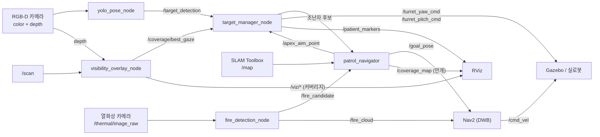

# UGV 실내 구조수색 로봇

**시각 커버리지 기반 자율 정찰 · 조난자 트리아지 · 열화상 화재 회피**

[](https://docs.ros.org/en/humble/)
[](https://gazebosim.org/docs/harmonic)
[](https://navigation.ros.org/)
[](https://www.python.org/)
[](LICENSE)

---

## 초록

LiDAR SLAM 은 벽이 어디 있는지는 알려주지만 **카메라가 그곳을 실제로 들여다봤는지**는
모른다. 이 프로젝트는 둘을 분리한다 — 주행은 Nav2/SLAM 이 맡고, **관측 여부**는 별도
커버리지 격자가 관리한다. 로봇은 미관측으로 남은 사각지대로 스스로 향하고, 발견한
조난자 앞에서는 멈춰 서서 포탑을 조준한 뒤 좌표를 확정한다.

ROS 2 Humble + Gazebo Harmonic 위에서 6륜 스키드-스티어 UGV 로 구현했고, 조난자 배치와
정답 좌표가 알려진 재난 건물 맵에서 **유효 런 200회 이상**으로 측정했다.

#### 주요 결과

1. **30분 제한에서 조난자 7명 전원 발견 82 % · 90 %** — 로봇 2대, 유효 50런짜리 독립
   검증 2회 ([6.2절](#62-수색-완주-성능))
2. **완주율을 정하는 것은 알고리즘이 아니라 시간 예산이다** — 같은 코드로 20분 56 % →
   35분 91 % ([6.3절](#63-제한-시간의-영향))
3. **1대 → 2대는 확실한 이득** — 10분 시점 발견 인원 2배(3 → 6명), 두 머신·두 맵에서
   재현 ([6.4절](#64-로봇-대수-확장))
4. **2대 → 3대는 이득이 없다** — 원인은 Nav2 경로 탐색 실패 루프이며, 로봇당 발생률이
   1.9 % 에서 7.7 % 로 오른다 ([6.4절](#64-로봇-대수-확장))

<p align="center">
  
  <br><sub><b>그림 1.</b> 실물 기체 — 6륜 스키드-스티어 섀시 · 2-DOF 카메라 포탑 ·
  SLAMTEC LiDAR · Teensy 기반 전장</sub>
</p>

---

## 목차

**[1. 서론](#1-서론)** · **[2. 빠른 시작](#2-빠른-시작)** · **[3. 시스템 구성](#3-시스템-구성)** ·
**[4. 방법](#4-방법)** · **[5. 실험 설계](#5-실험-설계)** · **[6. 결과](#6-결과)** ·
**[7. 한계와 남은 과제](#7-한계와-남은-과제)** · **[8. 하드웨어](#8-하드웨어)** ·
**[9. 기술 스택](#9-기술-스택)** · **[문서](#문서)** · **[라이선스](#라이선스)**

---

## 1. 서론

### 1.1 문제

재난 건물 수색에서 "지도를 다 그렸다" 와 "다 봤다" 는 다르다. LiDAR 는 방을 통과만 해도
점유격자를 채우지만, 그 방 구석에 누운 사람은 카메라 화각에 한 번도 들어오지 않을 수
있다. SLAM 지도상으로는 멀쩡해 보이는 이 사각지대가 실제 미탐지의 주된 원인이다.

두 번째 문제는 등록 정확도다. 이동 중에 검출 결과를 그대로 좌표로 쓰면 값이 튄다. 구조
임무에서 좌표 오차는 곧 구조대의 헛걸음이다.

### 1.2 접근

- **관측 여부를 1급 상태로 둔다.** SLAM 점유격자와 별개로 "카메라가 실제로 본 곳" 격자를
  유지하고, 미관측 영역을 목표로 삼는다.
- **발견과 등록을 분리한다.** 후보를 보면 접근·정지·조준한 뒤 표본을 모아 좌표를 확정한다.
- **종료 조건을 인원수로 준다.** 구조본부가 아는 실종자 수를 다 채울 때까지 끝내지 않는다.

동일한 노드가 시뮬(Gazebo 플러그인)과 실로봇(Teensy MCU · RealSense · SLAMTEC LiDAR)
양쪽에서 동작하도록 설계했다.

### 1.3 구현 범위

**표 1.** 모듈별 구현 내용

| 영역 | 모듈 | 구현 내용 |
|---|---|---|
| Coverage | [`visibility_overlay_node.py`](src/ugv_vision/ugv_vision/visibility_overlay_node.py) | depth+LiDAR 레이캐스트로 "본 곳" 격자(`/coverage/grid`, 4-class), NBV 시선(`/coverage/best_gaze`), 블라인드 코너·FOV 시각화 |
| Exploration | [`patrol_navigator.py`](src/ugv_vision/ugv_vision/patrol_navigator.py) | 프론티어 + 커버리지 통합 탐사, 방 구석 우선 훑기, 지역 루프 탈출, 박힘 탈출, Nav2 생존 감시, 전장의 안개(`/coverage_map`) 발행 |
| Perception | [`yolo_pose_node.py`](src/ugv_vision/ugv_vision/yolo_pose_node.py) | YOLOv8n-pose 골격 검증, depth 거리 추정, 어깨 실제 높이 기반 자세 판정, 트리아지 분류 |
| Turret · 등록 | [`target_manager_node.py`](src/ugv_vision/ugv_vision/target_manager_node.py) | 2-DOF 포탑 조준, 정지·조준 확인(INSPECT) 후 표본 중앙값 등록, 관측 거리 비례 dedup |
| Fire | [`fire_detection_node.py`](src/ugv_vision/ugv_vision/fire_detection_node.py) | 열화상 blob → depth 거리 → 월드 투영, `/fire_cloud` 로 Nav2 코스트맵 마킹 |
| Navigation | [`odometry_node.py`](src/ugv_navigation/ugv_navigation/odometry_node.py) · `nav2_params.yaml` | 휠 오도메트리, Nav2(DWB) · SLAM Toolbox 설정, 화재 마킹 소스 연동 |

<p align="center">
  
  
  
  <br><sub><b>그림 2.</b> (왼쪽) 재난 건물 자율 주행 · (가운데) 카메라가 실제로 관측한 영역만
  표시하는 시각 커버리지 — 검정=미방문, 회색=지나갔지만 미확인, 투명=확인 완료 ·
  (오른쪽) 골격 검출과 트리아지 분류</sub>
</p>

---

## 2. 빠른 시작

설치·의존성은 **[SETUP.md](SETUP.md)** 를 따른다. 빌드 후:

```bash
source ~/ugv_ws/install/setup.bash
export GZ_SIM_RESOURCE_PATH=~/ugv_ws/install/ugv_description/share:$GZ_SIM_RESOURCE_PATH
```

**표 2.** 실행 명령

| 목적 | 명령 |
|---|---|
| Gazebo + 로봇 스폰만 (동작 확인) | `ros2 launch ugv_bringup gazebo.launch.py` |
| SLAM + Nav2 + 비전 풀스택 | `ros2 launch ugv_bringup slam_nav_sim.launch.py` |
| 구조수색 (기본 월드) | `ros2 launch ugv_bringup patrol_sim.launch.py` |

```bash
# 큰 월드에서 실종자 7명을 다 찾을 때까지 수색
ros2 launch ugv_bringup patrol_sim.launch.py \
    world:=rescue_building_large expected_victims:=7

# 로봇 2대 병렬 수색 — 권장 구성 (6.4절)
UGV_N_ROBOTS=2 UGV_BOUNDS=-27,-19,27,19 \
  ros2 launch ugv_bringup multi_robot_sim.launch.py \
    world:=rescue_building_large expected_victims:=7
```

<details>
<summary><b>기동 순서와 타이밍 제약</b></summary>

`0s` Gazebo·로봇 스폰 → `14s` SLAM → `22s` Nav2 → `48s` 비전 → `58s` 순찰·화재.

비전 노드(torch/CUDA 로딩)는 Nav2 활성화가 끝난 뒤에 띄운다. 겹치면 lifecycle 전환이
타임아웃나 `planner_server` 가 unconfigured 로 남는다.
</details>

실행 상세·튜닝은 **[HOW_TO_RUN.md](HOW_TO_RUN.md)**, 노드·알고리즘·토픽 전체 설계는
**[ARCHITECTURE.md](ARCHITECTURE.md)** 를 참조한다.

---

## 3. 시스템 구성

### 3.1 데이터 흐름



<p align="center"><sub><b>그림 3.</b> 노드 간 토픽 흐름</sub></p>

### 3.2 저장소 구조

<details>
<summary>펼쳐 보기</summary>

```text
.
├── README.md · SETUP.md · HOW_TO_RUN.md · ARCHITECTURE.md
├── docs/
│   ├── EXPERIMENTS.md          # 검출 실패 원인 규명 · 채택하지 않은 시도들
│   ├── SCALING.md              # 로봇 대수 × 맵 크기 확장성 실측
│   └── media/
├── tools/                      # 실험 러너 · 채점기 · 단위 테스트 17종
└── src/
    ├── ugv_vision              # 핵심 — 커버리지·탐사·탐지·포탑·화재
    │   ├── patrol_navigator.py            # 프론티어+커버리지 탐사, 안개 발행
    │   ├── target_manager_node.py         # 포탑 시선 + 정지·조준 확인 등록
    │   ├── yolo_pose_node.py              # YOLOv8n-pose 탐지 + 자세 판정
    │   ├── fire_detection_node.py         # 열화상 화재 감지·회피
    │   ├── visibility_overlay_node.py     # 커버리지 격자 + NBV 시선
    │   └── (vision_coverage_navigator · tactical_commander · visual_coverage_map)
    │                                      # 이전 버전, 현재 미기동
    ├── ugv_navigation          # Nav2 / SLAM 설정, 오도메트리
    ├── ugv_bringup             # 시뮬·실로봇 통합 launch, 월드 SDF
    ├── ugv_description         # URDF/xacro 모델, RViz 설정
    ├── ugv_msgs                # TargetDetection · ChassisCommand · TurretCommand
    └── ugv_teleop              # 조이스틱/키보드 텔레옵
```

서드파티(`micro_ros_setup` · `sllidar_ros2` · `uros`)는 포함하지 않는다. 실로봇 전용이라
시뮬 빌드에서 제외되며, 필요하면 `src/ros2.repos` 로 받는다.
</details>

---

## 4. 방법

### 4.1 시각 커버리지와 전장의 안개

SLAM 점유격자와 **별개의 "본 곳" 격자**를 유지한다. `patrol_navigator` 가 `/coverage_map`
으로 발행해 RViz 에서 안개처럼 표시되며(검정=미방문 · 회색=지나갔지만 미확인 · 투명=확인
완료), 방을 통과만 하고 구석을 안 본 경우를 드러낸다.

### 4.2 프론티어·커버리지 통합 탐사

- **주변 미관측 우선** — 들어간 방의 사각지대부터 훑고 나간다(연속 3회까지, 그 뒤 밖으로).
- **거리 비례 목표 제한시간**(`15초 + 거리/0.25`) — 고정 제한시간은 맵이 커지면 먼 목표를
  100 % 실패시킨다.
- **강제 이탈** — 후보가 마르면 8 m 이상 떨어진 가장 큰 미관측 구역으로 보내 지역 루프를
  끊는다.
- **생존 감시** — 박힘 감지 시 후진 탈출. Nav2 생존은 `/goal_pose` 구독자 수로 직접 확인한다.

### 4.3 정지·조준 확인 등록 (INSPECT)

이동 중 마킹하면 좌표가 튄다. 후보를 보면 **대상 앞 3.0 m 까지 접근 → 정지 → 포탑 조준 →
표본 5개 중앙값**으로 등록한다. 직선 접근이 막히면 대상 주위를 둘러 설 자리를 찾는다.

dedup 반경은 **관측 거리에 비례**한다. 위치 오차가 거리에 비례하므로(2.2 m 관측 → 오차
0.22 m / 4.8 m 관측 → 1.5 m) 고정 반경으로는 같은 사람을 둘로 등록한다. 더 가까이서 다시
보면 좌표를 갱신한다.

### 4.4 자세 기반 트리아지

트리아지 모델이 앉은 자세를 학습하지 않아 휠체어 환자가 정상(L3)으로 분류되던 문제를 기하
판정으로 보정했다. **다리 비율은 가림에 취약하다** — 휠체어는 바퀴가 다리를 가려 YOLO 가
기립 골격을 지어낸다. 그래서 가림에 강한 **어깨의 실제 높이**를 쓴다(깊이 + 화소 위치 +
카메라 높이, 핀홀 모델).

등급은 `L1:Critical`(누움) · `L2:NeedHelp`(부축 필요) · `L3:Normal`(자력 대피) 이다.
L2 는 '의학적으로 급함' 이 아니라 **'스스로 대피할 수 없음'** 을 뜻한다 — 이 로봇은
활력징후를 재지 못한다.

### 4.5 열화상 화재 감지·회피

열화상 blob 의 **모든 픽셀**로 거리를 추정한다(가장자리만 쓰면 벽으로 튄다). 조난자와
동일하게 정지·조준 확인 후 등록하고, 실패한 열원은 일정 시간 재시도를 억제한다.
`/fire_cloud` 를 Nav2 global costmap 마킹 소스로 물려 **경로 자체가 화재를 피한다.**

### 4.6 실종자 수 기반 종료

`expected_victims` 로 구조본부가 아는 실종자 수를 주면 다 찾기 전에는 수색을 끝내지 않고,
채우는 즉시 보고한다.

### 4.7 다중 로봇 구역 분할

`UGV_N_ROBOTS` 로 1~3대를 구성한다. 탐사 경계(`UGV_BOUNDS`)를 대수로 나눠 구역을 배정하고
스폰 좌표도 같은 규칙으로 계산한다. 자기 구역을 다 훑으면 동료 구역으로 넘어가 돕는다.
지도·표적·화재를 공유하고 목표를 선점해 같은 곳으로 몰리지 않게 한다.

---

## 5. 실험 설계

### 5.1 환경

**표 3.** 맵

| 맵 | 크기 | 조난자 | 화재 | 용도 |
|---|---|---:|---:|---|
| `rescue_building` | 28 × 20 m | 3 | 2 | 기능 확인 |
| `rescue_building_large` | 56 × 40 m | 7 | 4 | 완주율 · 1대↔2대 |
| `rescue_building_xl` | 84 × 40 m | 13 | — | 로봇 대수 확장 |

큰 월드의 조난자 배치는 **누움 3 / 서있음 3(잔해에 가린 1 포함) / 휠체어 1** 이며,
트리아지로는 L1 3명 · L2 1명 · L3 3명이다.

**표 4.** 실험 머신

| 머신 | CPU | RAM | GPU | 쓰인 곳 |
|---|---|---:|---|---|
| 메인 | Ryzen 7 5800X (8C/16T) | 64 GB | RTX 3060 12 GB | 전체 |
| 에일리언웨어 | i7-10700KF (8C/16T) | 32 GB | RTX 3080 10 GB | XL 재현 검증 |
| OMEN | Ryzen 9 7950X3D (16C/32T) | 32 GB | RTX 3090 Ti 24 GB | 큰 월드 1대↔2대 |

전부 Ubuntu 22.04 · ROS 2 Humble · Gazebo Harmonic, `headless:=true` 오프스크린 렌더다.

### 5.2 측정 원칙

1. **유효 런만 센다.** 로봇 중 하나라도 YOLO 가 아무것도 못 본 런(키포인트 0)과 중간에
   끊긴 런은 표본에서 제외한다. 무효는 조건마다 고르게 나지 않으므로 런 수가 아니라
   유효 런 수로 채운다.
2. **조건을 머신에 붙이지 않는다.** 세 조건을 한 머신 안에서 번갈아 돌리고, 머신마다 시작
   순서를 다르게 준다. 조건과 머신을 붙였다가 결과가 뒤집힌 적이 있다.
3. **두 머신에서 재현될 때만 채택한다.**
4. **지표는 '고정 시점에 센 인원수'** 다. '전원 발견까지 걸린 시간' 은 가장 늦게 찾은 한
   명이 값을 정하는 최댓값 통계라 편차가 크고, 시간 안에 못 끝낸 런이 표본에서 빠져 완주한
   런만 비교하게 된다.

상세와 함정은 **[docs/SCALING.md](docs/SCALING.md)** 에 있다.

---

## 6. 결과

### 6.1 탐지·측위 정확도

**표 5.** 자동 채점(`tools/run_eval.sh`) 결과 — 큰 월드

| 항목 | 결과 |
|---|---|
| 트리아지 정확도 | **7/7** (L1 2명 · L2 1명 · L3 4명) |
| 평균 위치 오차 | **0.54 m** (표본 산포 0.01 m 이하) |
| 화재 발견 | **4/4** (오차 0.41~0.60 m) |
| 오탐 · 중복 등록 | 0건 |
| Nav2 사망 · goal 오인 | 0회 |

작은 월드도 조난자 3/3 · 트리아지 3/3 · 화재 2/2 로 합격한다.

> **주.** 표 5 는 **조난자 배치를 바꾸기 전** 값이다. 7명 중 4명이 멀쩡히 서 있어 어려운
> 자세가 거의 시험되지 않아서 배치를 바꿨다(표 3). 위치 오차와 화재 측위는 배치와 무관한
> 인식 스택 지표라 그대로 유효하지만 트리아지 내역은 옛 구성 기준이며, 6.2 이후 완주율은
> 모두 **바뀐 배치**에서 다시 잰 값이다.

### 6.2 수색 완주 성능

**로봇 2대는 같은 30분에서 1대를 크게 앞선다.**

**표 6.** 큰 월드(56 × 40 m, 조난자 7명) 완주 성능

| | 1대 | 2대 |
|---|---|---|
| 7/7 완주까지 | 중앙값 **26분** (22~38분) | 중앙값 **18분** (12~30분) |
| 30분 안에 완주 | **4/7 (57 %)** | **82 % · 90 %** |
| 조난자별 발견률 | 7명 전원 7/7 | `lying_s2` 84~94 % · 나머지 96~100 % |
| 유령 검출 | 1건 / 7런 | 2건 · 1건 / 각 50런 |

2대는 **유효 50런짜리 검증을 두 번**(머신당 25런씩) 돌려 82 % 와 90 % 가 나왔다. 신뢰구간이
겹쳐 서로 모순되지 않지만, 두 검증 사이에 계측 로깅이 추가돼 코드가 완전히 같지는 않으므로
**합치지 않고 따로 적는다.** 한 번만 쟀으면 어느 쪽이든 과신이었을 폭이다.

**표 7.** 개선 경과 (7/7 완주율)

| 설정 | 완주율 |
|---|---|
| 포탑 수평 · `seen_min_dirs` 끔 | 22 % |
| 포탑 0.20 rad | 67 % |
| **포탑 0.10 rad + `seen_min_dirs`** | **82 % · 90 %** |

원인 규명 과정은 **[docs/EXPERIMENTS.md](docs/EXPERIMENTS.md)** 에 있다.

### 6.3 제한 시간의 영향

**완주율을 정하는 것은 탐사 알고리즘이 아니라 시간 예산이다.**

못 찾은 런은 대부분 같은 조난자(남서 방 바닥에 누운 사람)를 놓친다. 그 방은 남쪽 다섯 방 중
유일하게 내부 칸막이가 있어 문이 15 m 깊이 주머니의 구석에 붙어 있다. **그 주머니 안쪽까지
내려간 런은 34런 중 33런이 찾았고, 못 내려간 런은 6런 중 0런이 찾았다.**

탐사 알고리즘의 결함으로 보고 여덟 가지를 시험했지만 이득이 확인된 것은 하나도 없었다.
제한을 45분으로 늘리자 **기본 설정이 그 조난자를 11런 전부 찾았다.** 로봇은 그 구석에 갈 줄
안다 — 30분 안에 못 갈 뿐이다.

**표 8.** 제한 시간별 7/7 완주율 (2대)

| 제한 시간 | 완주율 |
|---|---|
| 20분 | 56 % |
| 25분 | 77 % |
| **30분** | **86 %** |
| 35분 | 91 % |
| 40분 이상 | 91 % |

86 % 는 알고리즘의 한계가 아니라 30분이라는 예산의 값이다. 더 올리려면 탐사 정책이 아니라
시간이나 로봇 대수를 늘리는 쪽이다.

### 6.4 로봇 대수 확장

**표 9.** XL 월드(84 × 40 m, 조난자 13명, 제한 45분) 시점별 발견 인원 — 메인

| 구성 | 유효 런 | 10분 | 20분 | 30분 | 45분 |
|---|---:|---:|---:|---:|---:|
| 1대 | 6 | 3 / 2.7 | 6 / 6.0 | 10 / 8.7 | 11 / 10.8 |
| **2대** | 26 | **6 / 5.9** | **9 / 9.2** | **11 / 11.3** | **12 / 12.1** |
| 3대 | 26 | 6 / 5.9 | 9 / 9.2 | 11 / 10.5 | 12 / 11.3 |

<sub>중앙값 / 평균</sub>

**(a) 1대 → 2대는 확실한 이득이다.** 10분 시점 발견 인원이 두 배(3 → 6명)이며 두 머신·두
맵에서 재현됐다.

**(b) 2대 → 3대는 이득이 없다.** 초반(10 · 20분)은 완전히 같고 후반에 3대가 뒤진다. 45분
분포에서 2대는 최저 11명 · 전원 발견 5런인데, 3대는 최저 8명 · 10명 미만 3런이고 전원 발견은
0런이다.

**(c) 원인은 Nav2 경로 탐색 실패 루프다.** 로봇당 `planner_server` Abort 가 2.2배로 늘고
(23.6 → 51.0회), Abort 가 많은 런이 그대로 성적이 나쁜 런이다(417회 → 8명). 2대에서는 Abort
167회짜리 런도 12명을 찾아 상관이 없다.

**표 10.** 실패 루프 발생률 (planner Abort ≥ 100회를 '루프' 로 판정)

| | 2대 | 3대 |
|---|---:|---:|
| 로봇당 발생률 | 1.9 % | **7.7 %** |
| 그런 런의 비율 | 4 % (1/26) | **23 %** (6/26) |

로봇 수만 늘어난 것이라면 3대의 런 비율은 1−(1−0.019)³ = 5.6 % 여야 하는데 실측은 23 % 다.
**로봇 하나하나가 더 위험해진다** — 주 복도가 하나뿐이라 세 대가 서로를 코스트맵 장애물로
보면 경로가 막히는 상황이 잦아지고, 한 번 빠진 로봇은 복구행동을 돌며 45분을 태워 그 구역이
통째로 비어 버린다.

더 단순한 설명 두 가지를 먼저 검토했으나 모두 기각됐다.

**표 11.** 기각한 대안 설명

| 설명 | 검증 방법 | 결과 |
|---|---|---|
| 호스트 CPU 가 3대를 감당하지 못한다 | Nav2 제어주기 놓침을 로봇 1대당으로 환산 | 메인은 3대에서도 1.55회로, 45분 런에서 1~2회다. 반대로 8.8배 놓치는 머신에서는 2대와 3대가 동률이었다 |
| 벽시계 제한이 3대의 임무 시간을 깎는다 | 런마다 실제로 받은 시뮬 시간을 측정 | 2대 2650초 · 3대 2643초로 같다. 2700초를 못 채운 런은 양쪽 3런씩인데 전부 전원 발견으로 일찍 끊긴 런이다 |

측정 절차와 런별 값은 [docs/SCALING.md](docs/SCALING.md) 에 있다.

> **주 — (b)(c) 는 메인 한 대에서만 나온 잠정 결론이다.** 에일리언웨어에서 2대 16런 · 3대
> 15런을 쟀는데 그쪽에서는 **둘이 동률**이었다(45분 평균 11.9 대 11.9). 기전은 메인에서
> 분명히 보였지만 그것이 어느 환경에서나 3대를 나쁘게 만드는지는 확인되지 않았다.
> **권장 구성은 2대**다 — 3대가 이득이라는 근거는 어느 머신에서도 없다.

작은 월드(28 × 20 m)에서는 대수를 늘려도 이득이 없었다. 다중 로봇이 값어치를 하려면 방이
충분히 많아야 한다.

---

## 7. 한계와 남은 과제

1. **탐사 시간의 약 30 %(70분 중 17~23분)를 유령 후보에 쓴다.** 멀리서 사람처럼 보인 대상까지
   접근·정지·조준한 뒤 버리는 비용이다. 접근 전에 걸러내려 세 가지를 시도했고 **셋 다
   실패했다** — 프레임 단위 필터링으로는 접근 낭비가 줄지 않는다(후보가 다른 프레임에서 다시
   뜨므로). 남은 방향은 접근 비용 자체를 줄이는 쪽이다.
2. **오탐이 인원수를 채우면 '전원 발견' 이 잘못 보고된다.** 실제로 1회 발생했다(잔해와 벽
   사이 빈 공간을 사람으로 인식). 자세 판정으로는 거를 수 없어 다른 시점에서 재확인하는
   방식이 필요하다. 채점기는 이 사고를 자동으로 잡는다.
3. **3대 구성의 실패 루프를 아직 고치지 않았다**(표 10). 방향은 planner 실패가 일정 횟수를
   넘으면 그 목표를 버리고 다른 구역으로 보내거나, 로봇끼리 코스트맵에서 서로를 지우는 쪽이다.
4. 커버리지 완주 후의 회차 완료 보고는 아직 실측하지 못했다.
5. 직선 접근이 막혔을 때의 우회 접근은 단위 테스트로만 검증됐다(실측 발동 0회).
6. 실로봇 통합은 진행 중이다. 열화상 카메라는 시뮬 전용이며 실기에는 아직 없다.

---

## 8. 하드웨어

**표 11.** 기체 사양

| 구성 | 사양 |
|---|---|
| 구동 | 6륜 스키드-스티어 · 바퀴 r=42 mm · 트랙 162.5 mm · 최대 0.65 m/s |
| 포탑 | 2-DOF(yaw+pitch) · 110 rpm(≈1.15 rad/s) · 카메라 마운트 |
| 카메라 | RealSense depth+RGB · 수평 FOV 62° · 640×480 |
| LiDAR | SLAMTEC(RPLIDAR) 360° |
| 제어 | Teensy MCU(micro-ROS) ↔ Jetson Orin · x86_64 데스크탑 이식 |

Perception(D435i·LiDAR) → High-level(Jetson Orin Nano: YOLO 트리아지·SLAM·Nav2)
↔ Real-time(Teensy 4.1: EKF 융합·PID·6WD 스키드 기구학)
→ Actuation(BTS7960 ×7 모터 드라이버·포탑 서보).

<p align="center">
  
  <br><sub><b>그림 4.</b> 실물 기체 전면</sub>
</p>

<p align="center">
  
  <br><sub><b>그림 5.</b> 3계층 시스템 아키텍처</sub>
</p>

---

## 9. 기술 스택

**표 12.** 사용 기술

| 분류 | 사용 기술 |
|---|---|
| 미들웨어 | ROS 2 Humble · Python 3.10 · Ubuntu 22.04 |
| 시뮬레이션 | Gazebo Harmonic (gz-sim8) |
| 자율주행 | Nav2 (DWB) · SLAM Toolbox · robot_localization (EKF) |
| 인식 | YOLOv8n-pose (Ultralytics) · scikit-learn (RandomForest 트리아지) · OpenCV |
| 실로봇 | micro-ROS (Teensy 4.1) · SLAMTEC LiDAR · RealSense |

---

## 문서

| 문서 | 내용 |
|---|---|
| [SETUP.md](SETUP.md) | 설치 · 의존성 · 빌드 |
| [HOW_TO_RUN.md](HOW_TO_RUN.md) | 실행 · 튜닝 · 트러블슈팅 |
| [ARCHITECTURE.md](ARCHITECTURE.md) | 노드 · 알고리즘 · 토픽 전체 설계 |
| [docs/EXPERIMENTS.md](docs/EXPERIMENTS.md) | 검출 실패 원인 규명 · 채택하지 않은 시도들 |
| [docs/SCALING.md](docs/SCALING.md) | 로봇 대수 × 맵 크기 확장성 실측 |

## 라이선스

[MIT](LICENSE)
