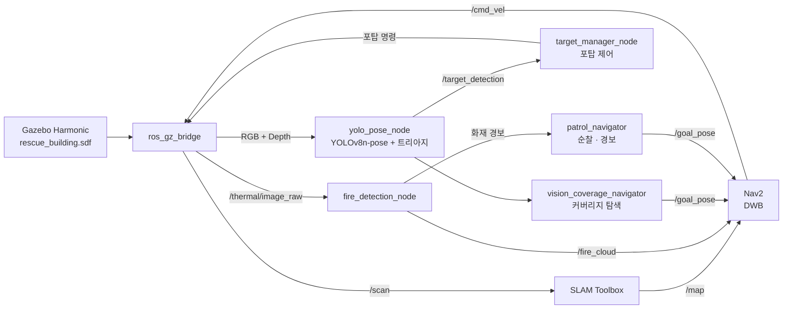

# A.R.G.U.S.

**A**utonomous **R**escue **G**round **U**nit **S**ystem — 재난 상황에서 건물 내부를 자율 수색하며 조난자를 찾고 중증도를 분류하는 6륜 UGV 시스템.

`ROS2 Humble` · `Gazebo Harmonic (gz-sim8)` · `Nav2` · `SLAM Toolbox` · `YOLOv8n-pose`

---

## 무엇을 하는 로봇인가

건물 안에 투입되면 스스로 지도를 그리며 방을 훑고, 쓰러진 사람을 찾아 얼마나 급한지 판단해 지도에 찍어줍니다. 순찰 모드에서는 열화상으로 화재를 감지해 그 구역을 피해 다닙니다.

```
건물 내부 투입
  → SLAM으로 지도 작성하며 자율 주행
  → 'Slicing the Pie' 전술 기동으로 사각지대까지 탐색
  → YOLOv8n-pose로 인체 골격 감지
  → RandomForest 트리아지 분류 (L1 Critical / L2 Urgent / L3 Normal)
  → RViz 3D 맵에 조난자 위치·중증도 마킹
  → 운용자가 목표 지점을 찍으면 즉시 수동 우선, 도착 후 자율 탐색 재개
```

## 주요 기능

| 기능 | 내용 |
|------|------|
| **자율 수색 주행** | SLAM Toolbox로 지도를 만들며 Nav2(DWB)로 이동. 라이다 맵과 별개로 **카메라가 실제로 본 영역**을 격자로 관리해, 지나갔지만 못 본 구역을 다시 훑습니다 |
| **조난자 감지 · 트리아지** | YOLOv8n-pose로 골격을 잡고, 자세·비율 특징을 RandomForest에 넣어 3단계 중증도로 분류. 바운딩박스 대각선 기반 거리 추정 폴백 포함 |
| **2-DOF 포탑 추적** | 탐색 시 ±50° 사인파 스윕, 대상 포착 시 픽셀 오차 P제어로 추적. 이미 기록한 조난자는 재추적하지 않고 탐색으로 복귀 |
| **열화상 화재 감지** | 열화상 blob을 depth로 거리 추정해 월드 좌표로 투영. 화재 지점을 Nav2 global costmap에 마킹해 **경로 자체가 화재를 피하도록** 함 |
| **경비 순찰** | 웨이포인트를 순회하다 화재를 만나면 정지 → 포탑 조준 → 경보 → 해당 구역 우회 후 순찰 재개 |

## 빠른 시작

설치는 [docs/SETUP.md](docs/SETUP.md)를 따르세요. 설치가 끝났다면:

```bash
source ~/ugv_ws/install/setup.bash
export GZ_SIM_RESOURCE_PATH=~/ugv_ws/install/ugv_description/share:$GZ_SIM_RESOURCE_PATH

# ① Gazebo + 로봇 스폰 + 브리지만 — 동작 확인용
ros2 launch ugv_bringup gazebo.launch.py

# ② SLAM + Nav2 + 비전 풀스택
ros2 launch ugv_bringup slam_nav_sim.launch.py

# ③ 경비 순찰 + 열화상 화재 감지 (②에 순찰·화재 노드 추가)
ros2 launch ugv_bringup patrol_sim.launch.py
```

노드들이 0~12초에 걸쳐 순차 기동(SLAM 4s / Nav2 8s / 비전 10s / 순찰·화재 12s)하므로
초반에 덜 뜬 것처럼 보이는 건 정상입니다.

## 시스템 구성



## 패키지 구조

| 패키지 | 역할 |
|--------|------|
| `ugv_description` | URDF/xacro 로봇 모델(6륜·2-DOF 포탑·LiDAR·RGBD·열화상), RViz 설정 |
| `ugv_bringup` | 런치 파일, 월드 SDF(`rescue_building`, `warehouse`) |
| `ugv_vision` | YOLO 조난자 감지·트리아지, 포탑 추적, 커버리지 탐색, 화재 감지, 순찰 |
| `ugv_navigation` | Nav2/SLAM 파라미터, 실로봇 오도메트리 노드 |
| `ugv_teleop` | 조이스틱/키보드 텔레옵 |
| `ugv_msgs` | `TargetDetection`, `ChassisCommand`, `TurretCommand` |

서드파티(`micro_ros_setup`, `sllidar_ros2`, `uros`)는 이 저장소에 포함되지 않습니다.
실로봇 전용이라 시뮬 빌드에서는 제외되며, 필요하면 `src/ros2.repos`로 받으세요.

## 주요 토픽

| 토픽 | 타입 | 설명 |
|------|------|------|
| `/scan` | `LaserScan` | 360° LiDAR, 1080 샘플, 10 Hz |
| `/camera/camera/color/image_raw` | `Image` | RGB 640×480, 15 Hz |
| `/camera/camera/aligned_depth_to_color/image_raw` | `Image` | 정렬된 Depth |
| `/thermal/image_raw` | `Image` | 열화상 mono16, 픽셀값 = 온도[K] / 0.01 |
| `/target_detection` | `TargetDetection` | 조난자 위치·거리·트리아지 등급 |
| `/fire_heatmap`, `/fire_cloud` | `OccupancyGrid`, `PointCloud2` | 화재 히트맵 / Nav2 마킹용 포인트 |
| `/turret_yaw_cmd`, `/turret_pitch_cmd` | `Float64` | 포탑 각속도 명령 |
| `/detection/image_annotated`, `/fire/image_annotated` | `Image` | 사람 / 화재 오버레이 |

## 하드웨어 (실로봇)

| 항목 | 사양 |
|------|------|
| 차체 | 6륜 스키드 스티어, 50×34×14 cm, 5.0 kg |
| 구동 | 좌/우 3륜 독립 속도 제어, 최대 0.65 m/s, 슬립 보정 1.45 |
| 포탑 | 2-DOF (Yaw ±90°, Pitch ±30°), 최대 1.15 rad/s |
| LiDAR | RPLIDAR (시뮬은 Gazebo GPU LiDAR, 0.12~25 m) |
| 카메라 | Intel RealSense D435i (RGB-D + IMU), FOV 62° |
| MCU | Teensy — 엔코더 3960 ticks/rev, 포탑 피드백 |

## 개발 · 검증 환경

| | 개발/검증 | 실로봇 배포 |
|---|---|---|
| 플랫폼 | Ubuntu 22.04 x86_64, RTX 3060 | Jetson Orin aarch64 |
| 시뮬레이터 | Gazebo Harmonic 8.14.0 | — |
| ROS2 | Humble | Humble |
| PyTorch | 2.12.1+cu130 (GPU 추론) | 2.8.0 (CUDA 12.6) |

시뮬 실측: RTF 1.0, `/scan` 9.8 Hz, `/odom` 50 Hz, RGB 15 Hz, 열화상 10 Hz,
YOLO 추론 9.2 ms/frame (108.9 FPS, RTX 3060).

## 문서

- [docs/SETUP.md](docs/SETUP.md) — 설치 가이드 (Step 1~9, 트러블슈팅, Gazebo 버전별 주의사항)
- [docs/ARCHITECTURE.md](docs/ARCHITECTURE.md) — 하드웨어 사양, 노드별 상세 스펙, 핵심 알고리즘(Slicing the Pie, Perception Assistance Layer, VisualCoverageGrid), 토픽 플로우, 이슈 이력

## 현재 상태

시뮬레이션에서 전체 파이프라인(주행 · SLAM · Nav2 · 조난자 감지/트리아지 · 열화상 화재 감지 · 순찰)이
동작합니다. 실로봇 통합은 진행 중입니다.

**알려진 이슈**

- 순찰 웨이포인트 중 건물을 가로지르는 구간에서 기본 타임아웃(45초)을 넘겨 건너뛰는 경우가 있습니다. `patrol_navigator`의 `wp_timeout` 파라미터로 조정할 수 있습니다.
- 로봇 스폰 직후 RTF가 일시적으로 0.001까지 떨어지는데, ogre2 셰이더 최초 컴파일 구간이며 잠시 후 1.0으로 회복됩니다. 자세한 내용은 [SETUP.md의 Gazebo 버전별 주의사항](docs/SETUP.md#gazebo-버전별-주의사항) 참고.
